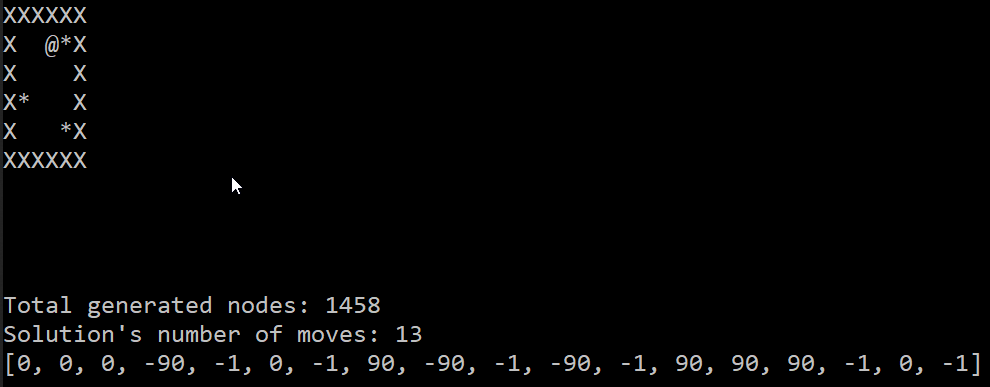
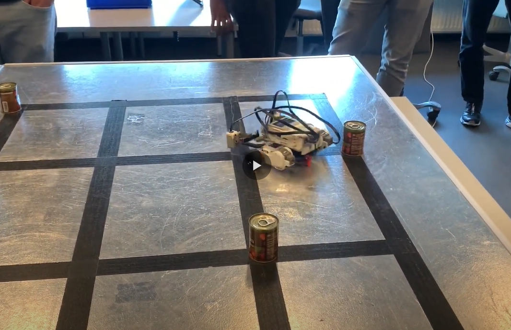

# Warehouse Robot (Sokoban Solver)

*ITU - Autumn 2022 - Advanced Robotics - Group 3*

**Team members:**

- Balázs Tóth (balazs.toth818@gmail.com)
- Boris Karavasilev (karavasilev.boris@gmail.com)
- Michele Imbriani (imbr.mic@gmailc.com)


## Introduction

This repository contains our [code](./src/solver.py), [unit tests](./tests/) and the [report](./report.pdf) that we created during our mini-project. The goal of this project was to build a robot out of LEGO Mindstroms EV3 and implement a controller with a hierarchical architecture. The controller consists of two subsystems. First, is the low level controller running on the robot that is able to execute a plan by following the edge of a line and detecting intersections. Second, is a high level planner running on a PC that solves the "Sokoban" type of challenge and generates a plan for the low level system.

To run the solver:

```cmd
> python solve_map.py
```

To upload the micro python code to the LEGO EV3 robot install the LEGO Mindstorms extension, open the file "main.py" and press *Ctr+F5* in VS Code.

## Solver output example:



### Used symbols

```
X - wall
# - wall
$ - can/diamond
. - goal
* - can/diamond on a goal
@ - robot/man
a - robot on a goal
```

## Video
👇 Video of our robot in action during a classroom competition. 👇

[](https://youtu.be/fp0sEyfc36w)
